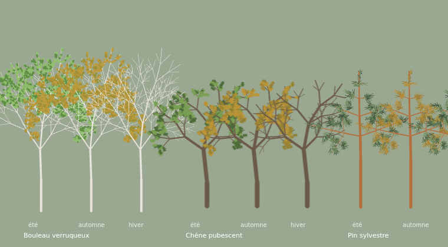

# Lot L0 — la pointe technique, et ce qu'elle a tranché

> Mesuré le 2026-09-04. Le prototype vit dans `spike/` et `src/spike/`, le
> script de mesure dans `scripts/l0-mesure.mjs`. **Il est fait pour être
> rejoué** : une des conclusions ci-dessous ne peut pas être tirée dans un
> conteneur sans carte graphique.

> **À relire avec une date en tête.** Ces mesures ont été prises *avant* le
> recalibrage des hauteurs sur les tables de production (`5bbbb78`, arrivé sur
> `main` le même jour). La scène figée porte donc une forêt trop courte : h max
> 15,1 m à l'an 50, là où un peuplement calé sur les tables en donnera le double
> ou davantage. Ce qui **ne change pas** : le nombre de tiges, qui vient de la
> régénération et de la mortalité, et la règle sur les primitives vectorielles,
> qui ne dépend pas de la taille des sujets. Ce qui **est sous-mesuré** : la
> surface de remplissage par image et le coût de cuisson de l'atlas, tous deux
> à peu près quadratiques en hauteur. Comme la marge de D1 est de 9 ms sur un
> budget de 16,7 ms, **c'est assez pour qu'il faille rejouer le banc** avant que
> le lot L1 ne s'appuie sur ces chiffres. Voir la fin du document.

## Le pire cas, enfin mesuré au lieu d'être estimé

Le document d'inventaire parlait de « friche en succession, ~5 000 tiges ».
Vérifié en faisant tourner le moteur sur la station `friche-limon` en 1 ha
(100 × 100 m), météo réelle, graine 42 :

| année | arbres | dont chandelles | h max | tiges < 1 m |
|---|---|---|---|---|
| 10 | 2 275 | 20 | 3,9 m | 1 208 |
| 25 | 5 066 | 1 289 | 9,6 m | 1 032 |
| **50** | **5 017** | **1 059** | **15,1 m** | 1 082 |

L'estimation était juste, et la charge **plafonne vers l'an 25** : la friche se
sature à cinq mille tiges et s'y tient. À l'an 50 : ronce 992, bouleau 974,
prunellier 577, sureau 361, troène 243, aubépine 187. C'est cette scène-là,
sortie du moteur et figée en JSON, que le banc rejoue — pas une scène inventée.

**Ce que ça dit du LOD** : un cinquième des tiges fait moins d'un mètre. À la
parcelle entière, elles occupent moins de trois pixels. Le LOD n'est pas une
optimisation tardive, c'est une part importante de la scène dès le premier jour.

## D1 / Q1 — Pixi ou Canvas 2D : **je ne peux pas trancher ici, et il faut le dire**

Le conteneur n'a **pas de carte graphique**. Chromium y rend WebGL en logiciel :

```
ANGLE (Google, Vulkan 1.3.0 (SwiftShader Device (Subzero)), SwiftShader driver)
```

Or tout l'intérêt de Pixi est le GPU. Mesurer Pixi sur SwiftShader, c'est
mesurer exactement ce qu'il n'apporte pas. Les chiffres ci-dessous sont donc à
lire avec ça en tête (90 images, scène complète, médiane par image) :

| style | Canvas 2D | Pixi v8 (**logiciel**) |
|---|---|---|
| aplats | **9 ms** (p95 141) | 16,2 ms (p95 65) |
| liseré | **9,1 ms** (p95 18) | 36,2 ms (p95 360) |
| ombre portée par image | 73,9 ms (p95 1 737) | **2,2 ms** |
| zoom 4 (détail rapproché) | **7,9 ms** | 78,6 ms |

**Ce qui EST tranché, et qui compte** : Canvas 2D tient le pire cas **en pur
logiciel**, à 9 ms par image au zoom 1 et 7,9 ms au zoom 4 — le budget des
60 images par seconde est de 16,7 ms. C'est un résultat de sécurité fort : le
rendu ne dépend pas d'un GPU pour être fluide sur une parcelle saturée.

**Renversement de D1.** Le document faisait de Pixi le choix par défaut et de
Canvas 2D le témoin. C'est l'inverse qu'il faut retenir : **Canvas 2D d'abord**,
puisqu'il suffit sans GPU, avec zéro dépendance et un contrôle total sur des
formes qui sont procédurales de toute façon. Pixi devient l'**option de
montée en charge**, à prendre si et quand les particules du lot L8 le
réclament — et le seul chiffre du tableau qui plaide pour lui est justement
celui-là (voir ci-dessous).

**À rejouer sur ta machine**, c'est une commande :

```bash
npm run dev &                     # sert /spike/index.html
node scripts/l0-mesure.mjs        # mesure et exporte les captures
```

## Le seul résultat indépendant du GPU, et le plus actionnable

La ligne « ombre portée par image » : dessiner 5 017 ellipses par image coûte
**73,9 ms à Canvas 2D contre 2,2 ms à Pixi** (où ce sont des sprites). Un
facteur trente, et il ne doit rien au GPU — il vient du coût d'une primitive
vectorielle appelée cinq mille fois par image.

**La règle qui en sort, et elle vaut pour les deux bras : aucune primitive
vectorielle par image.** Ombres, halos, liserés, marqueurs de changement : tout
est cuit une fois dans un bitmap ou posé en sprite. C'est la contrainte
d'architecture la plus importante que ce lot ait produite, et elle ne se voit
sur aucune capture.

## L'atlas à la demande : validé, et son coût est le vrai risque

**474 silhouettes suffisent aux 5 017 arbres** — 10,6 arbres par texture. La
conception « on ne cuit que les combinaisons présentes, avec un cache »
fonctionne : les paliers de hauteur (12, logarithmiques), quatre formes par
essence et trois états foliaires replient la diversité sans qu'on la voie.

**Mais le coût de cuisson a explosé à mesure que les silhouettes devenaient
bonnes** :

| version des silhouettes | par silhouette | les 474 |
|---|---|---|
| première, grossière (arbres nus) | 0,3–0,5 ms | 46 ms |
| finale, reconnaissables | 4–13,3 ms | **1 740–3 369 ms** |

Trois secondes de gel au premier affichage : inacceptable. La cause est
identifiée et n'a rien de mystérieux — le nombre de segments croît en
(branches par nœud)^(ordres), et le bouleau est le pire cas (dominance faible,
six ordres, trois filles par nœud). Trois remèdes pour le vrai générateur :

1. **plafonner le nombre de segments** par arbre, quel que soit le paramétrage ;
2. **cuire à UNE taille de référence** et mettre à l'échelle, au lieu de cuire
   par palier de hauteur — c'est ce qui divise le travail par douze ;
3. **étaler la cuisson sur plusieurs images** plutôt que tout au premier
   affichage.

## D4 — les silhouettes reconnaissables : validé, avec une correction de méthode



Bouleau, chêne pubescent et pin sylvestre, en été, en automne et en hiver,
squelette généré par branchement et feuilles tracées à la main. **Ils se
distinguent au premier coup d'œil**, y compris nus : le fût blanc et les
rameaux fins du bouleau, le tronc sombre et la masse globuleuse du chêne, les
étages horizontaux et le fût orangé du pin.

**Mais le houppier n'ÉMERGE PAS du branchement, et c'est la correction que ce
lot apporte au §4 du document.** Il a fallu :

- baisser la dominance apicale du bouleau de 0,85 à 0,62 et lui ajouter un
  ordre : à 0,85, l'axe garde tout et le feuillage finit en touffe au sommet
  d'un bâton ;
- donner au pin un port **étagé** distinct (un axe droit et des verticilles
  presque horizontaux) au lieu d'une fourche : aucun réglage d'angle sur un
  port fourchu ne produit un cône ;
- **écourter explicitement les étages vers le sommet** : sans cette
  décroissance imposée, le pin fait une boule.

Autrement dit : l'enveloppe du houppier doit être un **paramètre explicite** de
la fiche graphique, pas une propriété espérée du branchement. À corriger dans
le §4 avant d'écrire les vingt-cinq fiches, sinon on les écrira deux fois.

Trois bugs de la première version, pour mémoire, parce qu'ils sont instructifs :
les feuilles ne s'accrochaient qu'au dernier **ordre** de récursion (or les
branches deviennent trop courtes avant d'y arriver — le bouleau sortait nu) ;
le bitmap était dimensionné sur la hauteur nominale, donc les arbres étaient
coupés en haut ; et une feuille par rameau donne une brindille décorée, pas une
masse foliaire — il faut un **bouquet**.

## Q6 — le style

Trois traitements ont été rendus sur la scène complète. `liseré` ne coûte
**rien** de plus qu'`aplat` en médiane (9,1 contre 9 ms) et a un p95 bien
meilleur (18 contre 141 ms) ; l'ombre portée est à cuire, pas à dessiner.

Ma recommandation : **aplats avec liseré**, l'ombre en sprite cuit. Mais la
décision t'appartient, et les captures sont dans le prototype.

**Un constat de direction artistique qu'aucun chiffre ne donnait** : sur un
fond blanc cassé, **le bouleau disparaît**. Son écorce blanche est sa signature
la plus forte, et elle ne peut pas se lire sur un sol clair. Il a fallu passer
la planche à un vert-gris moyen pour que les trois essences se distinguent.
Conséquence pour §4 : la palette de sol ne peut pas être claire — ou bien le
bouleau a besoin d'un liseré sombre. C'est le genre de contrainte qu'on ne
trouve qu'en regardant.

## D3 — le relief à l'échelle vraie : confirmé bon marché

Le terrain se cuit en morceaux de 16 × 16 m (49 morceaux pour 10 000 cellules),
flancs verticaux et ombrage de pente compris : **62 à 114 ms**, une fois. Et
`projection.ts` porte la condition qui rend tout cela gratuit — un mètre
vertical occupe à l'écran ce qu'un mètre horizontal occupe en largeur, donc le
cube unité est un cube (test à l'appui).

## Ce que le lot laisse derrière lui

**Gardé** : `src/render/projection.ts` (pur, quatorze tests dont des propriétés
d'aller-retour sur terrain accidenté aux quatre orientations), ce document, et
le garde-fou de déterminisme dans `scripts/check-boundaries.sh` (`Math.random`
interdit dans `src/render`).

`pixi.js` est installé en **dépendance de développement**, pas de production :
seul le banc l'importe, et D1 ne l'a pas retenu par défaut. C'est là qu'il faut
qu'il soit tant que la question reste ouverte — et il ne coûte rien au paquet
livré à cet endroit.

**Jetable, mais gardé exprès** : `spike/` et `src/spike/` restent tant que D1
n'est pas tranchée sur une vraie machine — et il y a maintenant une seconde
raison de les garder. Le recalibrage des hauteurs (`5bbbb78`) rend la scène
figée obsolète : il faut la régénérer et rejouer les trois styles sur une forêt
de vraie taille. Deux mesures à refaire ensemble, donc, sur la même machine :
**Pixi contre Canvas 2D avec un GPU, et les deux sur des arbres deux fois plus
hauts.** Tant que ce n'est pas fait, le chiffre de 9 ms est un plancher, pas un
résultat. À supprimer ensuite, avec
`scripts/l0-mesure.mjs`.

`spike/scene-an50.json` est la scène **figée** : sortie du moteur (station
`friche-limon`, 1 ha, graine 42, cinquante ans de météo réelle) et versionnée
telle quelle. Elle n'est pas dans `public/` exprès — le banc est un outil de
développement, il n'a rien à faire dans le paquet livré — et elle est figée
plutôt que régénérée pour que le même jeu de cinq mille arbres soit mesuré
d'une machine à l'autre. Sans ça, comparer Pixi ici et Pixi sur ton GPU ne
voudrait rien dire.

Les conclusions ci-dessus sont reportées dans `docs/interface-visuelle.md`
v0.4, aux endroits marqués **(L0)** : D1, D4, §3, §4, §9, Q1, Q6 et le
risque n° 2.

## Ce qui change dans le plan

| Décision | Avant | Après L0 |
|---|---|---|
| **D1** | Pixi par défaut, Canvas 2D en témoin | **Canvas 2D par défaut**, Pixi en montée en charge — à confirmer sur GPU |
| **D4** | le houppier émerge du branchement | l'enveloppe du houppier est un **paramètre explicite** de la fiche |
| **Q6** | à trancher sur captures | aplats + liseré recommandés ; **le sol ne peut pas être clair** |
| — | (rien) | **aucune primitive vectorielle par image** — règle d'architecture |
| — | (rien) | l'atlas cuit à **une taille de référence**, pas par palier |
